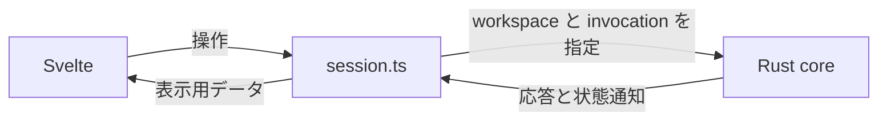

# Zeal 設計: セッションの所有と非同期応答

WebView は表示先と取得したデータを持ち、Rust core は実行中のプロセスを所有する。
workspace を切り替えても Rust の実行は変わらない。
全体の責務は [overview](./overview.md)、ファイルの配置は [frontend README](../../src/README.md) を参照する。

## 制御の経路

`session.ts` が画面の操作を受け、直接 IPC を await する。
内部の Message / Effect への変換と状態全体の複製を削除し、要求と応答の扱いを同じ関数に置く。
Svelte には状態から導出した `SessionView` を渡す。
フォーム入力、展開状態、Console の byte stream は各画面の処理に残す。

```mermaid
flowchart LR
  UI[Svelte] -->|操作| Session[session.ts]
  Session -->|表示用データ| UI
  Session -->|workspace と invocation を指定| Core[Rust core]
  Core -->|応答と状態通知| Session
```

## 古い応答を捨てる境界

選択中の workspace だけが target 一覧と履歴を持つ。
切替時に新しい Workspace object を作るため、A→B→A でも最初の A の応答は採用されない。
ターゲット選択と保存済み結果にも、それぞれの取得先 object を使う。
refresh と workspace open は要求ごとの token、start は要求の同一性と navigation の世代を照合する。
core の状態通知は revision が新しいものだけを採用する。

開始済み IPC の取消は行わない。
古い応答は現在の値を上書きせず、古いターゲットの次の取得段階にも進まない。
`dispose` は購読を解除し、以後の応答と操作を無視する。
購読登録が遅れて完了した場合も直ちに解除する。

## 必要な取得順序

同じ workspace の target 読み取りは detail → outputs → actions の順に await する。
取得中に選択が変わったら、その応答を捨てて最新の選択から始める。
outputs が失敗しても actions は取得する。
workspace を切り替えた場合は、古い workspace の読み取りを待たない。

履歴の取得中に複数の更新通知が来た場合だけ、後続の取得一回にまとめる。
履歴の選択中 record が変われば、同じ invocation の detail と profile を読み直す。
再取得の失敗時は、取得済みの値とエラーを併せて表示する。
関係ない core 通知では再取得しない。

## Console と結果画面

表示先は invocation ID を保持する。
その invocation の live Console があれば Console を表示し、core が所有を解放したら同じ ID の BEP 結果を表示する。
完了通知は表示先を変えないため、別の画面を見ている場合は移動しない。
BEP のビルド成功と、`bazel run` のプログラム終了は区別する。

[セッションのテスト](../../tests/session.test.ts) は公開操作、IPC の引数、表示結果でこれらの境界を検証する。
有限モデルの検査範囲と限界は [Invocation lifecycle model check](./invocation-lifecycle-check.md) に記載する。
